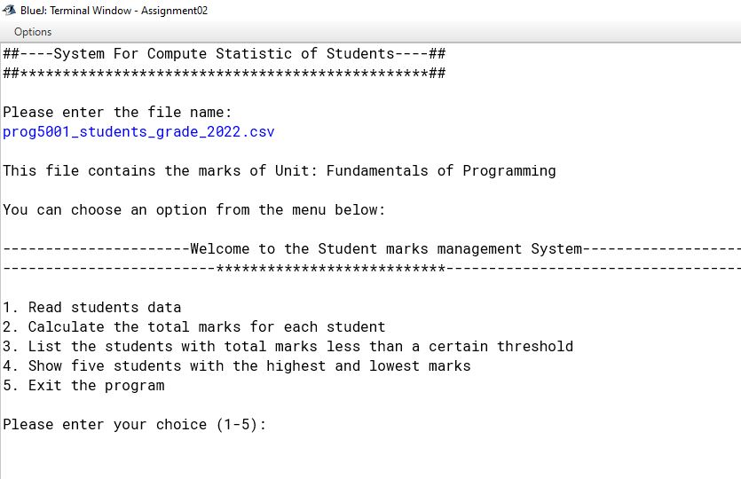

# PROG5001: 
FUNDAMENTALS OF PROGRAMMING

Develop a simple program to compute statistics of students' marks in an assignment

# Sample Screenshot of the UI  

<h1>: Create a simple menu system to allow users to select and execute each function</h1>

# Developers

  - Kulana Avinash Welihena Vithanage
  - 24354684

