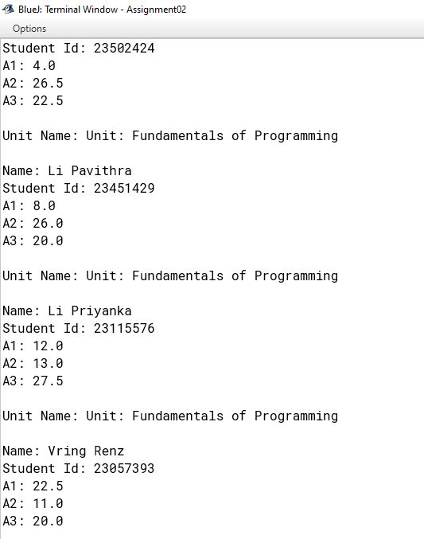
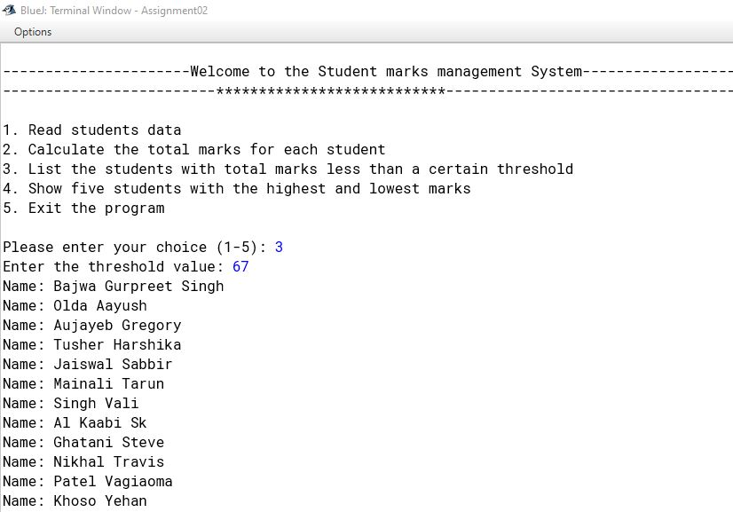

# PROG5001: 
FUNDAMENTALS OF PROGRAMMING

Develop a simple program to compute statistics of students' marks in an assignment

# Sample Screenshot of the UI  

<h1>Create a simple menu system to allow users to select and execute each function</h1>

<h1>Read Student data</h1>

<h1>Calculate the total marks for each student</h1>

<h1>Calculate the total marks for each student</h1>

<h1>List the students with total marks less than a certain threshold</h1>

<h1>Show five students with the highest and lowest marks</h1>

# Student Name:

  - Kulana Avinash Welihena Vithanage
  - 24354684

